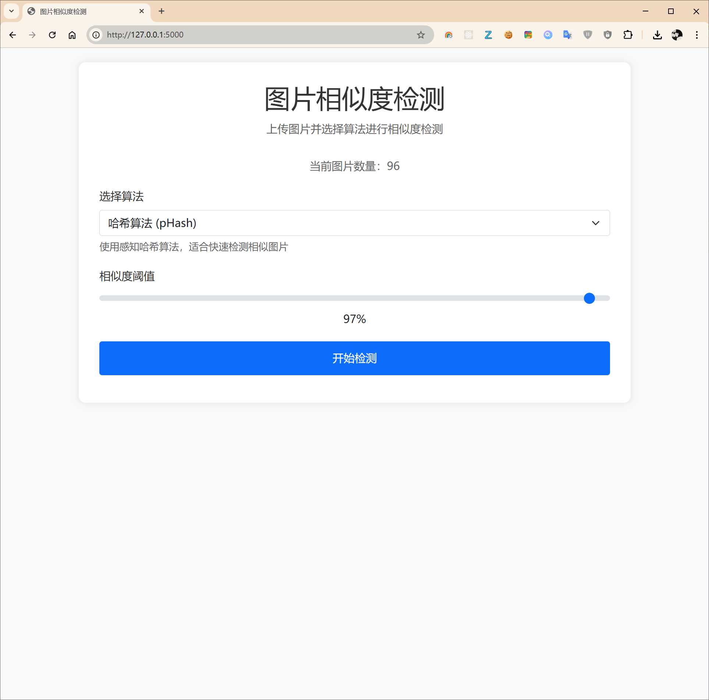
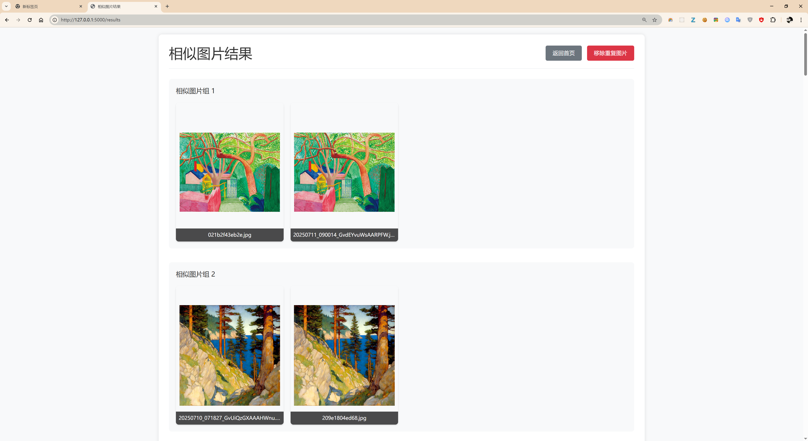

# 图像相似度查找器





这是一个基于 Flask 的 Web 应用，用于在一个文件夹中查找并展示相似的图片。

## 主要功能

-   **Web界面**: 通过简单的网页操作来启动图像分析。
-   **多种算法**: 使用感知哈希和颜色直方图等多种算法来比较图片。
-   **结果保存**: 将找到的相似图片组合保存在 `similar_pairs.json` 文件中。
-   **重复处理**: 将高度相似（疑似重复）的图片移动到 `dup_imgs` 文件夹。

## 如何使用

1.  **安装依赖**:
    ```bash
    pip install -r requirements.txt
    ```

2.  **准备图片**:
    将需要分析的图片放入 `test_imgs` 文件夹。

3.  **运行应用**:
    ```bash
    flask run
    ```
    或者
    ```bash
    python app.py
    ```

4.  **打开浏览器**:
    在浏览器中访问 `http://127.0.0.1:5000`，点击按钮开始处理。

## 核心文件结构

-   `app.py`: Flask 主程序
-   `requirements.txt`: 项目依赖
-   `img_utils/`: 存放图像处理脚本
-   `test_imgs/`: 存放待分析的原始图片
-   `dup_imgs/`: 存放被识别为重复的图片
-   `small_imgs/`: 存放生成的缩略图
-   `templates/`: 存放网页模板